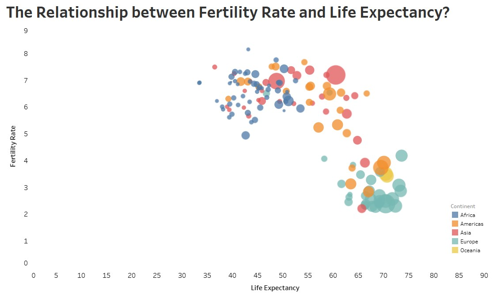

```{r setup, include=FALSE}
knitr::opts_chunk$set(echo = TRUE, message = FALSE, warning = FALSE, fig.width = 8, fig.height = 5)
library(tidyverse)
theme_set(theme_minimal())
```

In this post we'll recreate an infamous Gapminder scatter plot to help us visualize the relationship between fertility rate and life expectancy from 1900 - present day.



```{r}
library(gapminder)
library(tidyverse)
library(gganimate)
library(httr)

interactive <- FALSE
```

# Data

We'll 


